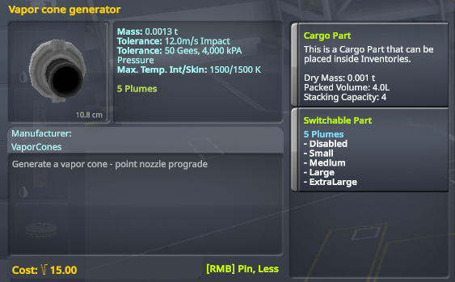
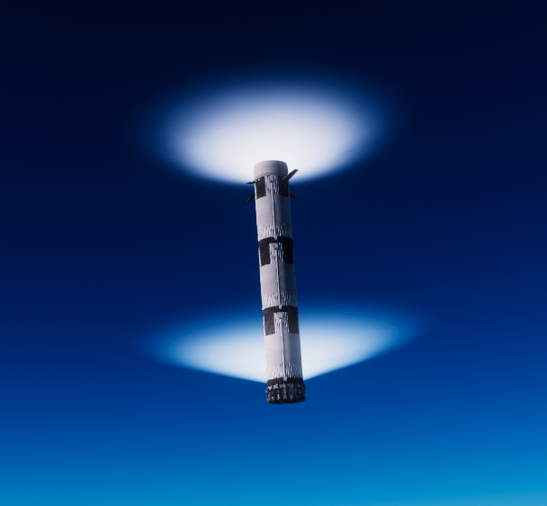
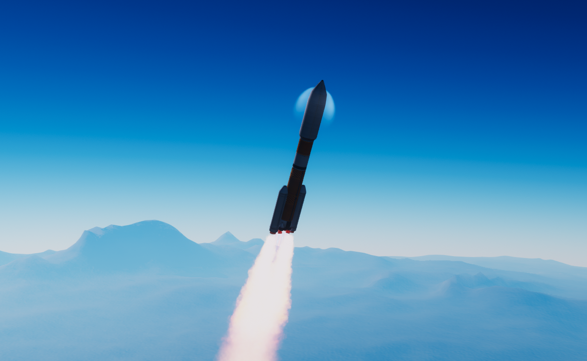
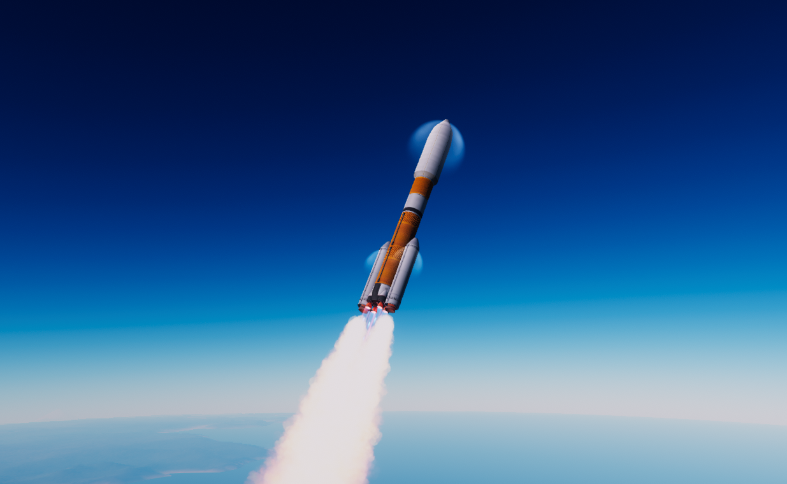

# Vapor Cones mod for KSP
Waterfall configs for faking volumetric transonic vapor cones (around Mach 0.95-1.05)

Now on [Spacedock](https://spacedock.info/mod/3814/Volumetric%20Vapor%20Cones)

## Features
* Adds a part to Utility called "Vapor cone generator" that looks like the small linear RCS port
* Includes 4 preset sizes and a disable option (for displaying cones in different orientations)
* Includes 2 shape variants, flat conical for aircraft and rockets and rounded for rockets

## How to use
* Just put the Vapor cone generator part wherever you want a vapor cone to be
* You can also change the vapor cone size in flight

## Issues
* Since it uses the Waterfall mod, it can only display cones in one orientation regardless of direction of motion
  * For stuff like booster returns, you can add two vapor cone generators in opposite directions and disable one or the other during flight

## Installation
* Download the repo as zip, unzip and merge GameData folder with your KSP GameData
  * Alternatively, you can directly copy the VaporCones folder into KSP GameData after downloading zip
* Make sure you have the requirements below

## Requirements
* Waterfall
* ModuleManager
* B9PartSwitch

## Screenshots
Flat conical vapor cones

.png)

Rounded vapor cones

## Credits
Waterfall configs loosely based on KnightOfStJohn's Stock Waterfall Effects configs